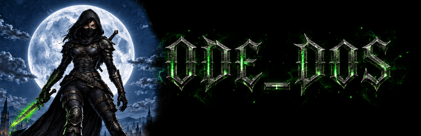

# 🗡️ ODE_DOS (BETA)

A Thief-style **Dark Object System** for Odin: prototype inheritance, mixins (metas), a typed link graph and data-driven authoring in [KDL](https://kdl.dev), built on [ODE_ECS](https://github.com/odin-engine/ode_ecs) and [ODE_KDL](https://github.com/odin-engine/ode_kdl).

ODE_DOS is based on Marc "MAHK" LeBlanc's GDC talk ["Game Entities in Thief: The Dark Project"](https://www.youtube.com/watch?v=5di7jmHKAQs).

ODE_DOS describes what designers author; your runtime stays yours:

- **Config** is everything designers author, loaded from KDL and baked: archetypes, metas, surfaces, properties, flags and the objects themselves.
- **Runtime** is your own ODE_ECS Database, or any data structure you build from Config. ODE_DOS never writes to it and never sees your entity ids.

ODE_DOS supports all "primitives" mentioned in the talk:

- Properties (config space components)
- Metas/MetaProperties (a set of config space components, for mixing into archetypes and surfaces)
- Archetypes and "inheritance" (config space entities)
- Surfaces (texture flyweights, so material questions cost one lookup)
- Flags (config space booleans), state flags and named effects
- Objects (the instances a designer authors) and their per-object overrides
- Links (a typed object-to-object graph)

Improvements over the original Thief-style **Dark Object System**:

1. Instead of building everything in an editor and saving the game's configuration in binary files, as Thief's designers did with DromEd, you describe it in KDL (https://kdl.dev) text files, a human-friendly document language that is cleaner than JSON. Because the files are plain text, designers can keep them in Git and diff, review and merge each other's changes.

2. ODE_DOS has a clear distinction between configuration (what designers define) and runtime state (what is happening in the game during playtime). ODE_DOS answers *"what is this thing?"*; ODE_ECS answers *"what do all these things do this frame?"*. Inheritance is flattened once by `bake`, so a game reads configuration with O(1) lookups and runs on plain ODE_ECS views and groups.

> NOTE: The project is in beta. Everything has been tested and is working, but it will be polished over the coming months.

## Features
- Load archetypes, metas, surfaces, objects and links from [KDL](https://kdl.dev) files, with
  `file:line:column` diagnostics and hot reload that tells you what changed.
- Config space sizes itself: each load grows it to exactly what the files declare.
- `bake` flattens inheritance into one value per archetype; an object's own value overrides it.
- Several Configs can chain, so a DLC pack extends a base game.
- Your runtime is plain ODE_ECS: your tables, your entity ids, your save files.
- Check your KDL files with a tool built on `cli_run` (see `samples/dos_tool`).

## Install

Clone the three repositories side by side in a `vendor/` folder inside your project, and import `vendor/ode_dos/src`:

```
git clone https://github.com/odin-engine/ode_ecs.git
git clone https://github.com/odin-engine/ode_kdl.git
git clone https://github.com/odin-engine/ode_dos.git
```

ODE_DOS imports its siblings as `../../ode_ecs/src` and `../../ode_kdl/src`.

## Example

```kdl
archetype "Physical" { mass 10.0 }
archetype "Creature" parent="Physical" { max-hit-points 100 }
archetype "Guard"    parent="Creature"

object "Guard01" archetype="Guard" {
    max-hit-points 75                     // this one is wounded
    transform { position 10.0 0.0 4.0 }
    status "Alerted"
}

object "Sword01" archetype="Physical"

link "Contains" from="Guard01" to="Sword01" { slot "RightHand" }
```

```odin
import "core:fmt"

import dos "vendor/ode_dos/src"
import ecs "vendor/ode_ecs/src"

Mass      :: struct { value: f32 }
Max_HP    :: struct { value: int }
Transform :: struct { position: [3]f32 }
Health    :: struct { current, max: int }

Slot     :: enum u8 { Left_Hand, Right_Hand }
Status   :: enum u8 { Dead, Unconscious, Alerted }
Contains :: struct { slot: Slot }

Game :: struct {
    // what designers author, described by ODE_DOS
    cfg:        dos.Config,
    mass:       dos.Property(Mass),
    max_hp:     dos.Property(Max_HP),
    transform:  dos.Property(Transform),   // per-object data is just a property
    rope:       dos.Flag,
    status:     dos.State_Flags(Status),   // authored initial flags
    effects:    dos.Effects,               // named bits: KnockedOut, Burning, ...
    contains:   dos.Link(Contains),        // a link flavor between designed objects

    // the running game, plain ODE_ECS, untouched by ODE_DOS
    db:         ecs.Database,
    transforms: ecs.Table(Transform),
    healths:    ecs.Table(Health),
    statuses:   ecs.Flags_Table,           // same enum, so the same bit indices
    fx:         ecs.Flags_Table,           // bits handed out by dos.effect_register
}

main :: proc() {
    g: Game
    defer dos.config_terminate(&g.cfg)
    defer ecs.terminate(&g.db)

    if err := declare(&g); err != nil {
        fmt.eprintln("cannot declare:", err)
        return
    }

    if dos.load(&g.cfg, "data") != nil {   // archetypes, metas, surfaces and objects; bakes
        for e in dos.errors(&g.cfg) do fmt.eprintln(dos.format_error(e, context.temp_allocator))
        return
    }

    if err := build(&g); err != nil {
        fmt.eprintln("cannot build the world:", err)
        return
    }

    guard01, _ := dos.find(&g.cfg, "Guard01")
    fmt.println(dos.resolve(&g.mass, guard01).value)     // 10, inherited from Physical
    fmt.println(dos.resolve(&g.max_hp, guard01).value)   // 75, the object's own value
}

// what designers may author
declare :: proc(g: ^Game) -> dos.Error {
    dos.config_init(&g.cfg, { keep_names = true }) or_return

    dos.property_init(&g.cfg, &g.mass, "mass") or_return
    dos.property_init(&g.cfg, &g.max_hp, "max-hit-points") or_return
    dos.property_init(&g.cfg, &g.transform, "transform") or_return
    dos.flag_init(&g.cfg, &g.rope, "can-attach-rope") or_return
    dos.state_flags_init(&g.cfg, &g.status, "status") or_return
    dos.link_init(&g.cfg, &g.contains, "Contains") or_return

    dos.effects_init(&g.cfg, &g.effects) or_return
    _ = dos.effect_register(&g.effects, "KnockedOut") or_return   // name -> bit, for KDL and tools

    return nil
}

// your runtime, built however you like
build :: proc(g: ^Game) -> ecs.Error {
    ecs.init(&g.db, 4096) or_return
    ecs.table_init(&g.transforms, &g.db, 4096) or_return
    ecs.table_init(&g.healths, &g.db, 4096) or_return
    ecs.flags_table_init(&g.statuses, &g.db, 4096) or_return
    ecs.flags_table_init(&g.fx, &g.db, 4096) or_return

    for obj in dos.objects(&g.cfg) {               // every object a designer authored
        e := ecs.create_entity(&g.db) or_return    // your entity id, never seen by ODE_DOS

        if t := dos.resolve(&g.transform, obj); t != nil {
            c := ecs.add_component(&g.transforms, e) or_return
            c^ = t^
        }
        if hp := dos.resolve(&g.max_hp, obj); hp != nil {
            c := ecs.add_component(&g.healths, e) or_return
            c^ = Health{ hp.value, hp.value }
        }

        // authored bits, one copy each
        ecs.set_flags(&g.statuses, e, dos.bits_of(&g.status, obj)) or_return
        ecs.set_flags(&g.fx, e, dos.bits_of(&g.effects, obj)) or_return

        it := dos.links_of(&g.contains, obj)
        for target, data in dos.next(&it) {
            fmt.println(dos.name_of(&g.cfg, obj), "contains", dos.name_of(&g.cfg, target), "in", data.slot)
        }
    }
    return nil
}
```

[samples/thief_demo](samples/thief_demo/main.odin) is a complete example; [samples/dos_tool](samples/dos_tool/main.odin) is a command-line tool built from the game itself.

## Documentation

See [docs/_index.md](docs/_index.md).

## Tests

```
cd tests && odin test . -define:ODIN_TEST_THREADS=1
```
